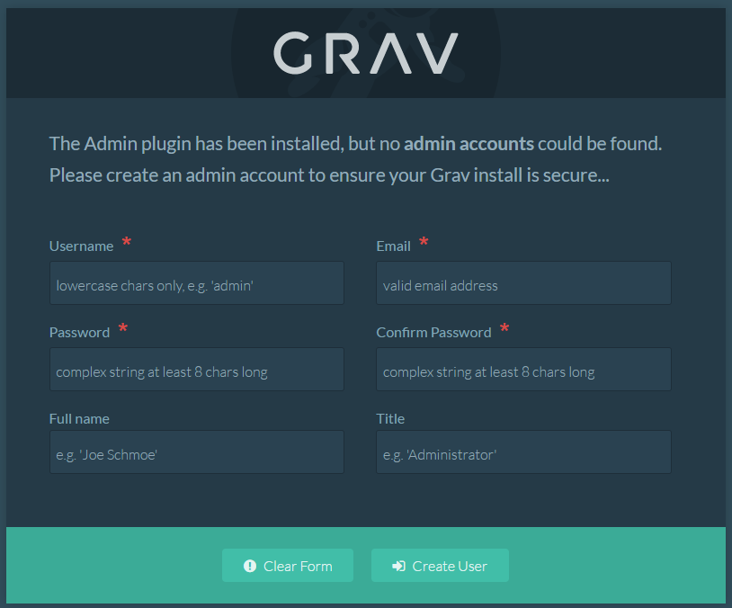

### GRAV Dockerized

A docker image for starting with [Grav CMS](http://github.com/getgrav/grav).

## Instrunctions

First od all clone this repo in your local file system:

```
git clone https://github.com/andreaschiona/grav-dokerized.git
```

Then, from the folder of the project build the image with docker-compose

```
docker-compose build
```

And starting the container with

```
docker-compose up
```

Now you have a fresh GRAV CMS with Admin Plugin installation.
Open your browser at `localhost` and you can see the following page:




For use Grav see the [lean documentation](https://learn.getgrav.org/)
